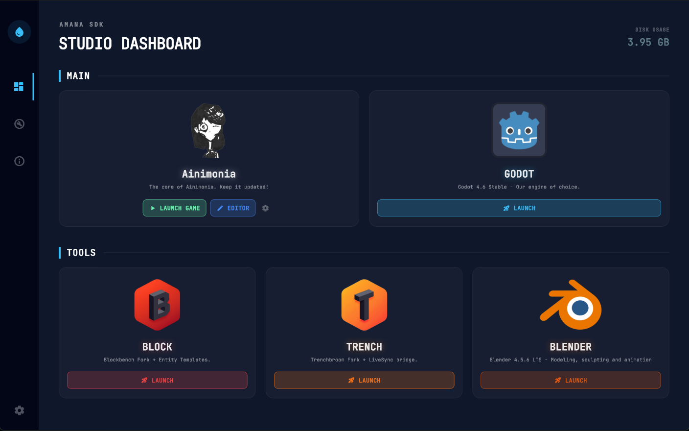

# AMANA SDK Hub 💧

Welcome to the internal engine room of **Amana Games**, an independent game development studio based in Brazil. 🇧🇷

The **AMANA SDK Hub** is our custom-built orchestration layer, designed to streamline our development workflow for our flagship project: **Ainimonia**. We believe that high-end game development requires high-end tooling, and this Hub is the bridge between our creative vision and our technical stack.

*Behold the Amana Hub: The cockpit of our indie development.*

---

## 🎯 The Objective

Developing an immersive world like **Ainimonia** requires a modular and highly specialized toolset. The AMANA SDK Hub's mission is to:
1. **Unify the Workflow**: Bring together level design, modeling, and engine work into a single "Command Center".
2. **Guarantee Portability**: Ensure the entire studio environment is "zero-install" and self-contained, allowing our team to switch machines or OSs (Windows/Linux) without configuration headaches.
3. **Automate Glue Logic**: Automatically link tools (e.g., teaching Godot where Blender is) and handle environment variables for data isolation.

---

## 🚀 The Ainimonia Tech Stack

At Amana Games, we stand on the shoulders of giants while carving our own path. Our workflow is built around powerful open-source tools—some of which we've adapted and forked to suit the unique needs of our world.

### 🎮 Ainimonia
Our main project. A journey into a deep, immersive world currently being forged for players worldwide.
> **Coming Soon:** We will soon have a dedicated page with more information and concept art. Stay tuned!

### 🤖 GODOT Engine (4.6 Stable)
We utilize **Godot 4.6 Stable** to power Ainimonia. The Hub manages **Self-Contained (SC)** mode, keeping all editor settings and data within the SDK folder.

### 📐 TRENCH (TrenchBroom Fork)
Our primary level design tool. A specialized fork of TrenchBroom that allows for a precise, "brush-based" workflow seamlessly integrated with Godot.
- **Repository:** [Amana-Games/TRENCH](https://github.com/Amana-Games/TRENCH.git)

### 📦 BLOCK (Model Editor)
Our specialized model editor, a sophisticated fork of Blockbench tailored for the Amana Games aesthetic and entity pipeline.
- **Repository:** [Amana-Games/BLOCK](https://github.com/Amana-Games/BLOCK.git)

### 🎨 BLENDER (4.5.6 LTS)
The industry standard for modeling, rigging, and animation. We rely on **Blender 4.5.6 LTS** for all high-fidelity assets. The Hub manages the portable installation and auto-configures the `blender_path` in Godot, enabling a seamless native `.blend` import workflow.

---

## 🐧 First-Class Linux Support

At Amana Games, **we love Linux!** 🐧 Most of our core development happens on Ubuntu. The AMANA SDK Hub handles permissions (`chmod +x`), paths, and data redirection (`HOME` isolation) with native efficiency, making game dev on Linux a beautiful experience.

---

## ✨ Features

-   **Zero-Config Setup**: One-click synchronization of the entire toolset and project source.
-   **Launch Protection**: Intelligent checks to ensure all dependencies are installed before project launch.
-   **Smart Launchers**: Handles complex arguments (e.g., Godot Editor mode `--path -e` vs. Game mode `--path`).
-   **Maintenance Dashboard**: Real-time disk usage, version tracking, and safe re-sync for individual tools.
-   **Full Isolation**: Tools like Trench and Block have redirected data directories to keep your OS clean.

---

## 💪 Amana Games: Small Studio, Big Vision

Being an indie studio in Brazil doesn't stop us from pushing the boundaries of technology. We invest heavily in our internal tools because we believe that a refined **Developer Experience (DX)** is the foundation of a superior **Player Experience (PX)**.

*Made with ❤️ by Amana Games.*
[amanagames.com](https://amanagames.com)
